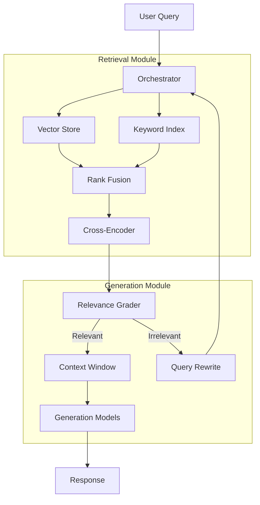

# Enterprise RAG Blueprint

  

**A Modular Reference Architecture for Production-Grade RAG Systems.**

This repository serves as an **educational blueprint** for developers looking to build scalable Retrieval-Augmented Generation (RAG) applications. It provides a structured starting point, demonstrating best practices in API design, service modularity, and hybrid search integration.

> **Note**: This repo contains the *skeletal structure* and *architectural patterns* of a deployed enterprise system. The core business logic has been abstracted to serve as a clean template for your own implementation.

---

## 🌟 Why Use This Blueprint?

Building a RAG system that scales beyond a Jupyter notebook is challenging. This project addresses the common engineering hurdles:

### 1. Hybrid Search Architecture

Most tutorials only cover vector search. This blueprint demonstrates a **Hybrid Retrieval** strategy:

- **Dense Retrieval**: Uses vector embeddings (OpenAI/HuggingFace) to capture semantic meaning.
- **Sparse Retrieval**: Uses keyword matching (BM25) to capture exact terms and acronyms.
- **Reranking**: Shows where to plug in a Cross-Encoder to refine results before sending them to the LLM.

### 2. Extreme Modularity

The codebase is decoupled to allow valid independent scaling:

- **`rag/`**: The core intelligence engine. Swappable.
- **`app/`**: The API layer. Unaware of the underlying model details.
- **`frontend/`**: A modern Next.js UI that consumes the API via streaming.

### 3. Scalable Infrastructure

Designed for the cloud:

- **Async everywhere**: Python `asyncio` for high-concurrency API handling.
- **Dockerized**: Ready for container orchestration (K8s/Cloud Run).
- **Stateless**: No server-side session state, making it infinitely horizontally scalable.

---

## 🏗 Architecture Overview

The system follows a **Graph-based** orchestration pattern (using LangGraph concepts).



## 🛠 Tech Stack

Use this stack to build modern AI apps:

- **Backend**: Python 3.11+, FastAPI
- **Orchestration**: LangChain components
- **Database**: PostgreSQL (`pgvector` for embeddings + JSONB for metadata)
- **Frontend**: Next.js 14, Tailwind CSS, TypeScript
- **Deployment**: Docker, Makefiles for automation

## 🚀 Getting Started

To use this blueprint for your own project:

### 1. Clone & Explore

```bash
git clone https://github.com/your-username/rag-blueprint.git
cd rag-blueprint
```

### 2. Understand the Structure

- **`app/routers/ask.py`**: Look here to see how to design a clean REST API for RAG, including streaming response handling.
- **`rag/chain.py`**: This file contains the stubbed logic for the retrieval graph. Fill this in with your own logic!
- **`rag/retrievers/`**: Implement your specific database connectors here.

### 3. Extend

The structure is pre-configured for:

- Adding new document loaders in `rag/ingest`.
- Swapping LLM providers (OpenAI, Anthropic, Llama) in `configs/`.

---

## 📚 Learn More

If you are studying RAG architectures, check out the [Architecture Documentation](docs/ARCHITECTURE.md) included in this repo for a deep dive into the theory behind **Corrective RAG** and **Self-RAG** patterns.

*Start building better AI systems today.*
