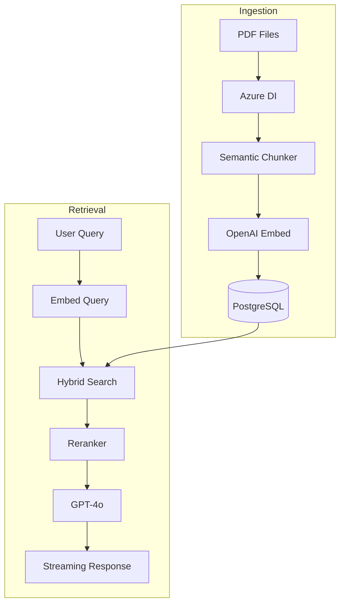

# AI Knowledge Hub - Architecture

## Tech Stack

| Layer | Technology | Purpose |
|-------|------------|---------|
| **Parsing** | Azure Document Intelligence | Extract Markdown + bounding boxes from PDFs |
| **Storage** | PostgreSQL + pgvector | Vector store with hybrid search |
| **Embeddings** | OpenAI `text-embedding-3-large` | 3072-dim vectors for retrieval |
| **LLM** | OpenAI `gpt-4o` | Answer generation |
| **Reranker** | OpenAI `text-embedding-3-large` | Cross-encoder reranking |
| **Backend** | FastAPI + LangChain | API and RAG orchestration |
| **Frontend** | Next.js + React + Tailwind | Chat UI with PDF viewer |

---

## Pipeline Overview



---

## Directory Structure

```
AI-Knowledge-Hub/
├── app/                      # FastAPI Backend
│   ├── main.py              # App entrypoint
│   ├── factory.py           # Pipeline builder from config
│   ├── ingest.py            # Ingestion CLI
│   ├── routers/             # API endpoints
│   │   ├── ask.py           # POST /api/ask
│   │   ├── library.py       # GET /api/library
│   │   ├── pdf.py           # PDF serving
│   │   └── health.py        # Health check
│   ├── adapters/            # Port implementations
│   │   ├── embed_openai.py  # OpenAI embedder
│   │   ├── vector_postgres.py # pgvector store
│   │   ├── llm_openai.py    # OpenAI LLM
│   │   └── rerank_openai.py # OpenAI reranker
│   └── services/            # Business logic
│       ├── qa.py            # Native QA pipeline
│       ├── prompting.py     # Persona prompts
│       └── formatting.py    # Citation formatting
├── rag/                      # RAG Core
│   ├── chain.py             # LangChain orchestration
│   ├── ingest_lib/          # Ingestion utilities
│   │   ├── parser_azure.py  # Azure DI parser
│   │   ├── chunk_bbox_mapper.py # Bbox mapping
│   │   └── discover.py      # PDF discovery
│   └── retrieval/           # Retrieval utilities
│       ├── utils.py         # Hit preparation
│       └── pdf_links.py     # PDF resolution
├── frontend/                 # Next.js Frontend
│   └── src/
│       ├── app/             # Pages (chat, library)
│       └── components/      # UI components
├── configs/                  # YAML configs
│   ├── runtime/openai.yaml  # Runtime config
│   └── ingestion/           # Ingestion config
├── data/                     # Data storage
│   └── raw/                 # Source PDFs
└── docker-compose.yml        # PostgreSQL service
```

---

## Configuration

### Runtime Config (`configs/runtime/openai.yaml`)
Controls model selection, retrieval parameters, and LangChain settings.

```yaml
embedder:
  model: text-embedding-3-large
llm:
  model: gpt-4o
  temperature: 0.2
retrieval:
  k: 6
  mode: dense
  rerank: true
```

### Environment Variables (`.env`)
```bash
OPENAI_API_KEY=sk-...
POSTGRES_CONNECTION_STRING=postgresql+psycopg2://...
AZURE_DOCUMENT_INTELLIGENCE_ENDPOINT=https://...
AZURE_DOCUMENT_INTELLIGENCE_KEY=...
```

---

## Key Components

| Component | File | Purpose |
|-----------|------|---------|
| API Entry | `app/main.py` | FastAPI app with routers |
| Pipeline Factory | `app/factory.py` | Builds QA pipeline from YAML |
| Q&A Endpoint | `app/routers/ask.py` | Handles `/api/ask` requests |
| Vector Store | `app/adapters/vector_postgres.py` | Hybrid search with pgvector |
| LangChain Chain | `rag/chain.py` | LCEL graph for retrieval + generation |
| Azure Parser | `rag/ingest_lib/parser_azure.py` | PDF parsing with bbox extraction |
| Prompts | `app/services/prompting.py` | Persona-aware system prompts |
