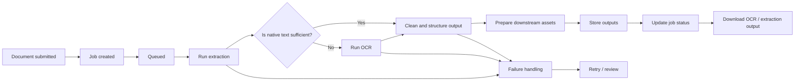

# GraphRAG Project Documentation
## Client-Facing Project Skeleton

## 1. Executive Summary

This document outlines the current direction, proposed architecture, and immediate delivery priorities for the GraphRAG project.

The current priority is a **graph-first architecture** supported by **clear Markdown-based documentation**. At this stage, the main goal is to define the project structure, explain the current and planned workflows, identify missing pieces, and establish a practical path forward.

The project direction is intentionally staged:

- **GraphRAG / graph-first architecture is the primary focus now**
- **Markdown documentation and architecture definition are core deliverables**
- **Microsoft GraphRAG is not assumed as the default implementation**
- **Environment selection is now being structured as a concrete A/B comparison between AI SDK and LangGraph**
- **Model/provider A/B testing will follow after the environment is chosen**

This document is intended to give the client a clear view of:

- what exists today
- what is proposed next
- what decisions remain open
- what can be chosen now to support implementation

## 2. Scope of Deliverables

The current scope is centred on documentation, architecture direction, MVP planning, and environment selection support.

### Core deliverables

- Client-facing Markdown documentation
- Current workflow documentation
- Planned workflow documentation
- GraphRAG direction and rationale
- High-level architecture proposal
- Missing pieces and open decisions
- User guide outline
- Concrete evaluation and environment recommendation
- Immediate next-step plan

### Priority workstreams

- **Task 2.2** — Technical wiki: comparison of **AI SDK vs Mastra vs LangGraph**
- **Task 4.1** — MVP admin features for ingestion at scale

### Later-phase items

The following remain important, but are not the immediate priority:

- model/provider comparison inside the chosen environment
- formal A/B testing of providers or models
- environment-specific optimisation
- production hardening beyond MVP scope

## 3. Project Direction

### Current direction

The project is currently moving toward a **GraphRAG-oriented architecture**, with graph structure and documentation as the immediate priority.

This means the team should focus on:

1. defining a graph-first workflow
2. documenting the architecture in a client-readable way
3. identifying what must be built first versus what should remain open
4. selecting an environment that supports both near-term delivery and long-term graph evolution

### Important position statements

#### Graph-first architecture is the main priority

The current focus is on designing a graph-oriented solution rather than expanding general-purpose RAG experimentation too early.

#### Microsoft GraphRAG is not the default assumption

Microsoft GraphRAG may be considered later as part of research and comparison, but it is **not** being assumed as the default implementation path.

#### Environment selection comes before provider/model comparison

The immediate recommendation is to choose the implementation environment first, then run provider/model A/B testing inside that chosen environment. This avoids mixing architecture decisions with model decisions too early.

## 4. Current Workflow

At present, the baseline workflow is primarily document-driven. It focuses on extracting content from documents, preparing text, and supporting retrieval through indexed content.

### Current workflow summary

1. Source documents are collected
2. Documents are parsed
3. Text is extracted
4. OCR is used where needed
5. Text is cleaned and normalised
6. Documents are chunked
7. Chunks are prepared for retrieval
8. Search results are returned to the user

### Current-state interpretation

The current workflow is a useful baseline for document ingestion and retrieval. However, it is not yet a full graph-first workflow.

The key limitation is that it is still largely built around document and chunk processing, rather than explicit graph construction across entities, relationships, and linked knowledge structures.

## 5. Planned Workflow

The planned workflow extends the current document pipeline into a graph-first retrieval architecture.

Rather than replacing the current pipeline entirely, the intention is to build on top of it by adding graph-aware processing and retrieval layers.

### Planned workflow summary

1. Ingest documents at scale
2. Extract and clean document content
3. Identify entities, concepts, and relationships
4. Build graph structures linking documents and knowledge elements
5. Support retrieval using both text relevance and graph context
6. Assemble traceable, grounded outputs
7. Evaluate the selected environment and then compare providers inside it

### Planned outcome

The planned workflow is intended to improve:

- contextual retrieval
- traceability
- relationship-aware knowledge access
- long-term architecture clarity

## 6. GraphRAG Direction

### Why GraphRAG is the current priority

A graph-first approach is the current priority because it better supports:

- connected knowledge representation
- retrieval across related concepts
- explainable relationships between documents and findings
- more structured long-term growth of the knowledge system

This is why the project is currently focused on **GraphRAG direction first**, rather than jumping straight into broad provider or model comparisons.

### Position on Microsoft GraphRAG

To be clear:

> **Microsoft GraphRAG is not assumed as the default implementation for this project.**

At this stage, the project should remain open to multiple graph-oriented approaches until the architecture, ingestion model, and evaluation needs are better defined.

### Recommended near-term stance

The recommended near-term position is:

- pursue **GraphRAG / graph-first architecture**
- stay **implementation-open**
- keep the solution **provider-flexible**
- choose the environment first
- compare providers and models after the environment is selected

## 7. Architecture Proposal

The proposed architecture should be modular, scalable, and flexible enough to support later implementation choices.

The immediate goal is not to lock into a single graph vendor, but to define the major architectural layers clearly and select an environment that supports them well.

### Architecture principles

- graph-first direction
- modular separation of concerns
- scalable ingestion support
- clear admin visibility
- provider flexibility
- later support for evaluation and comparison

### Proposed architecture layers

#### 7.1 Ingestion layer

Responsible for document intake, file registration, and triggering processing jobs.

#### 7.2 Extraction layer

Responsible for:

- document parsing
- OCR fallback
- structured content extraction
- metadata collection

#### 7.3 Processing layer

Responsible for:

- text cleaning
- chunking
- entity extraction
- relationship identification
- graph preparation

#### 7.4 Knowledge layer

Responsible for storing and linking:

- vector retrieval assets
- graph structures
- metadata and provenance information

#### 7.5 Retrieval layer

Responsible for combining document relevance and graph context into usable retrieval results.

#### 7.6 Admin layer

Responsible for batch ingestion, job visibility, operational control, and downloadable outputs.

#### 7.7 Evaluation layer

Responsible first for environment selection, and later for provider/model comparison inside the selected environment.

## 8. Missing Pieces

The project direction is now clearer, but several parts are still intentionally open.

### Missing architecture decisions

- final graph storage approach
- final retrieval orchestration approach
- how graph and vector retrieval will be combined
- how graph quality will be reviewed
- how the chosen environment will be implemented in the client’s preferred stack

### Missing product decisions

- admin workflow priorities
- operator review flow for OCR outputs
- final result presentation expectations
- user roles and access expectations
- practical ingestion assumptions for large document sets

### Missing evaluation decisions

- success criteria for environment selection
- evaluation dataset definition
- success criteria for retrieval quality
- success criteria for graph usefulness
- timing and structure for provider/model A/B testing after environment selection

### Missing documentation pieces to expand later

- final user guide
- operational runbook
- acceptance criteria by phase
- environment-specific implementation notes

## 9. User Guide Outline

This section is intentionally structured as an outline to be expanded later.

### 9.1 Overview

- What the system does
- What kinds of content it accepts
- What users can expect from retrieval and graph-based exploration

### 9.2 Uploading and ingesting documents

- How to add documents
- What happens after submission
- What processing stages are involved
- What each status means

### 9.3 Reviewing ingestion outputs

- How to inspect extraction results
- How to download OCR output
- How to identify failed or incomplete jobs

### 9.4 Searching and exploring knowledge

- How to submit a query
- How results are presented
- How linked context may appear in later graph-enabled versions

### 9.5 Understanding provenance

- Source document references
- Traceability to chunks or extracted content
- Why provenance matters for trust and review

### 9.6 Troubleshooting

- missing results
- OCR issues
- duplicate documents
- partial ingestion failures
- job retry guidance

## 10. Task 4.1 — Admin Features

### Objective

Deliver an MVP admin interface that supports ingestion at scale, including:

- ingestion up to approximately **2000 PDFs**
- OCR output download
- job-based processing
- status tracking

### MVP requirements

#### Functional requirements

- upload or register documents for ingestion
- queue processing as jobs
- display status per document or job
- expose failures and partial failures clearly
- allow OCR/extraction output download
- support retry or reprocessing behaviour later
- support batch visibility for large ingestion runs

### Why job-based processing is needed

Job-based processing is required because document ingestion at this scale is multi-stage and non-instant. A single document may require:

- intake
- parsing
- OCR
- cleaning
- chunking
- downstream preparation
- indexing
- graph preparation

A job-based model allows the system to:

- avoid blocking the interface
- support large-scale ingestion safely
- show progress clearly
- isolate failures
- support retries and operational visibility

### Job lifecycle

Suggested job states:

- Pending
- Queued
- Running
- Succeeded
- Partially Succeeded
- Failed
- Cancelled
- Archived

### Admin OCR job pipeline diagram

### OCR output download notes

Downloadable outputs are useful for:

- manual review
- troubleshooting
- extraction validation
- comparing OCR text with native text
- checking whether a document is suitable for later graph extraction

Suggested downloadable artifacts:

- raw OCR text
- cleaned extraction text
- extracted tables where available
- metadata summary
- processing/job summary

### Risks and considerations

- large-volume ingestion may expose bottlenecks not visible in small tests
- OCR quality may vary significantly by document type
- extraction quality may affect downstream graph usefulness
- admin workflow complexity can grow too quickly if status handling is unclear
- output downloads must be formatted consistently or they may become hard to review

### MVP boundary note

The goal of Task 4.1 is to make ingestion manageable and visible, not to design a full enterprise operations console in the first pass.

## 11. Task 2.2 — Technical Wiki: AI SDK vs Mastra vs LangGraph

### Objective

Provide a client-readable comparison of **AI SDK**, **Mastra**, and **LangGraph** in the context of this project.

This section is intended to support discussion and planning, not to force an immediate technology lock-in.

### Short summary of each

#### AI SDK

A lighter-weight option suited to application-facing integration, especially where the project needs clean model-connected functionality, structured outputs, tool use, and provider flexibility.

#### Mastra

A TypeScript framework that presents itself as an all-in-one stack with workflows, RAG, memory, evals, and tracing. That makes it relevant as a research option, especially if the client later wants a more bundled framework approach.

#### LangGraph

A workflow-oriented option well suited to multi-step, stateful, and branching logic. It is a strong fit if retrieval and orchestration become more complex over time.

### Strengths

#### AI SDK — strengths

- simpler application integration
- lower orchestration overhead
- strong provider flexibility
- good support for structured outputs and tool use

#### Mastra — strengths

- structured framework approach
- built-in positioning around workflows, RAG, memory, evals, and tracing
- potentially attractive for teams wanting a more bundled TypeScript framework

#### LangGraph — strengths

- strong support for explicit workflow control
- well suited to stateful and branching execution
- durable execution and graph-shaped workflow modelling are strong advantages for complex retrieval pipelines

### Limitations

#### AI SDK — limitations

- may be too lightweight for more complex orchestration later
- would likely require extra custom workflow structure if pipeline complexity grows

#### Mastra — limitations

- project fit is still not fully established
- could introduce more framework surface area than needed for an early graph-first MVP

#### LangGraph — limitations

- introduces more complexity earlier
- may be heavier than necessary during documentation-first and MVP-first phases

### Comparison table

| Option | Best fit | Strengths | Limitations | Likely role in this project |
|---|---|---|---|---|
| AI SDK | Product-layer integration | Lightweight, structured outputs, provider flexibility | Less suited to deep orchestration by default | Recommended initial environment |
| Mastra | Bundled TypeScript framework | Workflows, RAG, memory, evals, tracing in one framework | Fit still needs validation | Secondary research option |
| LangGraph | Complex workflow orchestration | Durable execution, state, branching, workflow control | Heavier to introduce early | Strong orchestration alternative |

### Recommendation for this project

#### Recommended near-term position

The project should not treat Microsoft GraphRAG as the default, and it should not hard-commit to Mastra or LangGraph too early.

#### Working recommendation

- **AI SDK** is the strongest initial environment if the goal is a faster MVP, clean product integration, and easier provider flexibility
- **LangGraph** is the stronger orchestration candidate if the workflow becomes more stateful, multi-step, and graph-heavy over time
- **Mastra** should remain in the technical wiki as a valid research option, but not the lead recommendation right now

#### Summary recommendation

For this project, the recommended position is:

- stay **graph-first**
- use **AI SDK** as the recommended initial environment
- keep **LangGraph** as the stronger orchestration alternative
- keep **Mastra** as a documented secondary option rather than the default recommendation

## 12. Evaluation Approach and Environment Recommendation

### Purpose of this section

This section is intended to support an actual environment decision.

The recommended first comparison for this project is:

- **Option A — AI SDK–led application architecture**
- **Option B — LangGraph-led orchestration architecture**

This is the most useful A/B because the client’s immediate decision is not only about model choice. It is also about how much workflow control, state management, and graph-aware orchestration the solution needs from the beginning.

### Recommended environment A/B

#### Option A — AI SDK

Use AI SDK as the primary application integration layer for model access, structured outputs, tool use, and provider flexibility.

#### Option B — LangGraph

Use LangGraph as the primary workflow orchestration layer for multi-step, stateful, graph-aware retrieval workflows.

### Why this is the recommended A/B

This A/B comparison helps answer the real architecture question:

- should the project optimise first for faster product integration and provider flexibility
- or should it optimise first for explicit multi-step orchestration and long-running graph-aware workflows

That is a more useful client decision than starting with a vendor-specific graph library comparison.

### Position on Mastra

Mastra should remain in the documentation and comparison work, but not as the lead A/B for the first environment decision. It is relevant because it bundles workflows, RAG, memory, evals, and tracing, but for this project the clearer first decision is still **AI SDK vs LangGraph**.

### Evaluation criteria

The client should assess the two environment options against the following criteria.

#### 1. Graph fit

How well does the environment support a graph-first retrieval architecture?

#### 2. Workflow control

How clearly can ingestion, OCR, extraction, retrieval, and context assembly be expressed?

#### 3. Product integration

How easily can the environment fit into an admin UI and user-facing search experience?

#### 4. Provider flexibility

How easily can the project compare or switch providers later?

#### 5. Operational clarity

How well does the environment support:

- ingestion jobs
- status tracking
- retries
- output review
- admin oversight

#### 6. Long-term extensibility

How well will the environment support graph expansion, retrieval refinement, and later provider/model testing?

### Comparison summary

| Evaluation area | Option A — AI SDK | Option B — LangGraph |
|---|---|---|
| Best early fit | Faster product integration | Stronger workflow orchestration |
| Graph-first flexibility | Good, with more custom orchestration | Strong, especially for graph-aware flows |
| Admin/job pipeline fit | Good for service-layer implementation | Stronger for explicit multi-stage control |
| Provider flexibility | Strong | Good |
| Complexity to adopt | Lower | Higher |
| Long-term retrieval sophistication | Moderate without extra orchestration | Strong |
| Recommended use case | Faster MVP application build | More structured graph-aware workflow platform |

### Recommendation

#### Recommended first choice

**AI SDK** should be the recommended initial environment **if the client wants the fastest path to an MVP that remains provider-flexible and easier to integrate into a product application**.

#### Recommended strategic alternative

**LangGraph** should be chosen first **if the client wants to optimise for a more explicit, durable, graph-aware workflow architecture from the beginning**, especially if retrieval and processing logic are expected to become complex early.

#### Final recommendation for this project

> **Start with AI SDK as the initial environment, while designing the solution in a graph-first way and preserving the option to introduce LangGraph later if orchestration complexity grows.**

This gives the project:

- a cleaner MVP path
- lower early implementation overhead
- provider flexibility
- room to evolve into stronger orchestration later

### Provider/model comparison after environment selection

Provider/model comparison should happen **after** the environment is chosen.

The most practical next A/B after environment selection is:

- **OpenAI**
- **Anthropic**

### Recommended evaluation process

#### Step 1 — Choose the environment

Select one of:

- Option A: AI SDK
- Option B: LangGraph

#### Step 2 — Build the same narrow pilot slice in both environments

Use the same pilot scope for both:

- sample document ingestion
- OCR handling
- chunk preparation
- initial graph extraction step
- retrieval
- result presentation
- admin status visibility

#### Step 3 — Score both against the evaluation criteria

Assess:

- development clarity
- graph-first fit
- retrieval workflow fit
- admin flow fit
- maintainability
- provider flexibility

#### Step 4 — Select the environment

Choose the one that gives the best balance of:

- delivery speed
- graph-first fit
- long-term extensibility

#### Step 5 — Run provider A/B inside the chosen environment

Only after the environment is selected, run provider/model comparison.

## 13. Immediate Next Steps

### Documentation

1. finalise the Markdown structure with client feedback
2. refine the current and planned workflow sections
3. convert missing pieces into tracked decisions and open questions
4. align terminology across all sections

### Task 4.1

1. define MVP admin use cases
2. confirm job states and status visibility needs
3. specify downloadable OCR/extraction outputs
4. draft a simple admin workflow or UI outline
5. clarify what ingestion at “up to 2000 PDFs” means operationally

### Task 2.2

1. refine the AI SDK vs Mastra vs LangGraph comparison
2. make the wording more project-specific
3. align recommendation wording with the graph-first direction
4. keep Mastra documented, but not as the lead recommendation

### Evaluation

1. confirm the client’s preference between AI SDK and LangGraph
2. define the pilot slice to compare environments consistently
3. prepare the later provider/model comparison plan
4. defer provider/model testing until after the environment is chosen

## 14. Summary Recommendation

The recommended path forward is to:

- continue with **GraphRAG / graph-first architecture as the primary priority**
- treat **Markdown documentation and architecture definition as core deliverables now**
- make clear that **Microsoft GraphRAG is not the default assumption**
- use **AI SDK as the recommended initial environment**
- keep **LangGraph as the stronger orchestration alternative**
- keep **Mastra as a documented secondary option**
- defer **provider/model A/B testing until after the environment decision**
- progress **Task 2.2** and **Task 4.1** in parallel, since together they support both architectural clarity and practical delivery

In short, the immediate value is in choosing an environment that supports a graph-first MVP cleanly, while keeping later provider comparison open. The recommended default is to **start with AI SDK**, preserve a **graph-first architecture**, and keep **LangGraph** available as the next-step orchestration path if workflow complexity grows.

