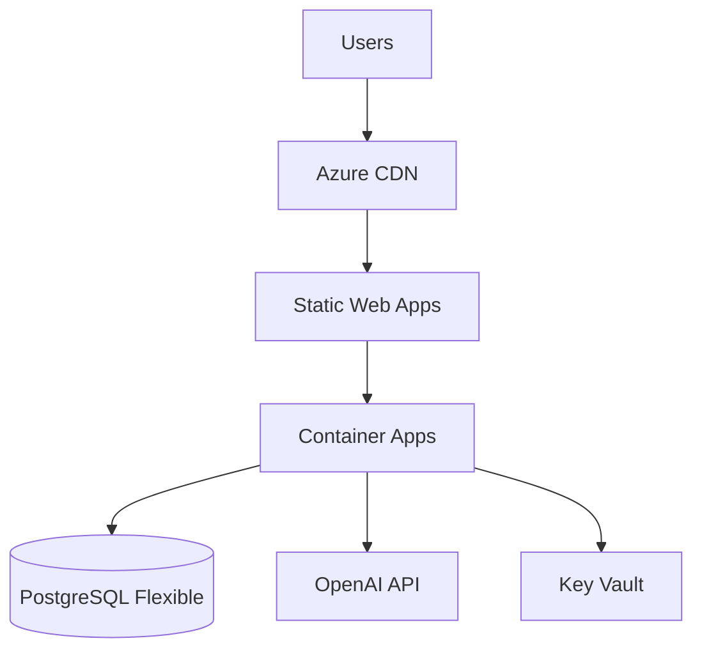

# Production Deployment (Azure)

## Architecture



---

## Azure Services

| Component             | Azure Service              | SKU                          |
| --------------------- | -------------------------- | ---------------------------- |
| **API Backend** | Container Apps             | Consumption (0.5 vCPU, 1GB)  |
| **Frontend**    | Static Web Apps            | Free tier                    |
| **Database**    | PostgreSQL Flexible Server | Burstable B1ms (1 vCPU, 2GB) |
| **Secrets**     | Key Vault                  | Standard                     |
| **Monitoring**  | Application Insights       | Pay-as-you-go                |

---

## Cost Estimates

### One-Time Ingestion (1000 PDFs)

| Item              | Cost            |
| ----------------- | --------------- |
| Azure DI (Layout) | ~$450           |
| OpenAI Embeddings | ~$6             |
| **Total**   | **~$456** |

### Monthly Operations

| Service                 | Estimated Cost |
| ----------------------- | -------------- |
| Container Apps          | $20-50         |
| PostgreSQL Flexible     | $50-100        |
| OpenAI API (5k queries) | $100           |
| Key Vault               | $1             |
| Application Insights    | $5-10          |
| **Total**         | **$175** |

---

## Deployment Steps

### 1. PostgreSQL Setup

```bash
# Create PostgreSQL with pgvector
az postgres flexible-server create \
  --name crdc-knowledge-db \
  --resource-group crdc-rg \
  --location australiaeast \
  --sku-name Standard_B1ms \
  --storage-size 32 \
  --version 16

# Enable pgvector extension
az postgres flexible-server parameter set \
  --name azure.extensions \
  --value vector \
  --resource-group crdc-rg \
  --server-name crdc-knowledge-db
```

### 2. Container Apps

```bash
# Create Container Apps environment
az containerapp env create \
  --name crdc-env \
  --resource-group crdc-rg \
  --location australiaeast

# Deploy API
az containerapp create \
  --name crdc-api \
  --resource-group crdc-rg \
  --environment crdc-env \
  --image ghcr.io/your-org/crdc-api:latest \
  --target-port 8000 \
  --ingress external \
  --env-vars OPENAI_API_KEY=secretref:openai-key
```

### 3. Key Vault Secrets

```bash
az keyvault secret set --vault-name crdc-vault --name openai-key --value "sk-..."
az keyvault secret set --vault-name crdc-vault --name postgres-conn --value "postgresql://..."
az keyvault secret set --vault-name crdc-vault --name azure-di-key --value "..."
```

---

## Environment Variables (Production)

```bash
# Required
OPENAI_API_KEY=@Microsoft.KeyVault(...)
POSTGRES_CONNECTION_STRING=@Microsoft.KeyVault(...)
AZURE_DOCUMENT_INTELLIGENCE_ENDPOINT=https://...
AZURE_DOCUMENT_INTELLIGENCE_KEY=@Microsoft.KeyVault(...)

# Optional
COTTON_RUNTIME=configs/runtime/openai.yaml
LOG_LEVEL=INFO
```

---

## Security Checklist

- [ ] CORS locked to frontend domain only
- [ ] API keys in Key Vault (not env vars)
- [ ] Database firewall rules configured
- [ ] HTTPS only (enforced by Container Apps)
- [ ] Rate limiting enabled
- [ ] Application Insights connected
