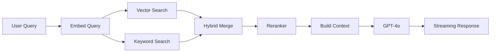

# Retrieval Pipeline

## Overview

The retrieval pipeline handles user queries through hybrid search, reranking, and LLM generation.



---

## Components

### 1. Hybrid Search
**File**: `app/adapters/vector_postgres.py`

Combines:
- **Vector similarity**: pgvector cosine distance
- **Keyword matching**: PostgreSQL `ts_rank_cd`
- **Weighted score**: `0.8 * vector + 0.2 * keyword`

```python
store.search_hybrid(query_text, embedding, top_k=12, filters={"year_min": 2020})
```

### 2. Reranker
**File**: `app/adapters/rerank_openai.py`

Cross-encoder reranking using `text-embedding-3-large`:
- Embeds query and each candidate
- Computes cosine similarity
- Returns top-k reranked results

### 3. LangChain Orchestration
**File**: `rag/chain.py`

LCEL (LangChain Expression Language) chain:
```
Query → Retriever → Reranker → Prompt Builder → LLM → Output Parser
```

Features:
- Streaming support
- Timing instrumentation
- Persona-aware prompts

### 4. Persona System
**File**: `app/services/prompting.py`

Three personas with different behaviors:

| Persona | Style | Citations |
|---------|-------|-----------|
| `grower` | Casual, practical | Optional |
| `researcher` | Technical, detailed | Required |
| `extension` | Educational | Required |

---

## API Endpoint

**POST `/api/ask`**

Request:
```json
{
  "question": "What are the best cotton irrigation practices?",
  "k": 6,
  "temperature": 0.2,
  "persona": "grower",
  "filters": {"year_min": 2020}
}
```

Response (streaming):
```json
{"type": "answer", "content": "Based on the research..."}
{"type": "sources", "citations": [...]}
{"type": "done", "usage": {...}}
```

---

## Deep Linking

Each citation includes:
- `page`: Page number in PDF
- `bbox`: `[x, y, width, height]` for highlighting
- `filename`: PDF filename for serving

The frontend uses these to:
1. Open PDF at correct page
2. Draw highlight rectangle over source text

---

## Configuration

**`configs/runtime/openai.yaml`**:
```yaml
retrieval:
  k: 6                    # Final results
  mode: dense             # Search mode
  rerank: true            # Enable reranking
  neighbors: 1            # Adjacent chunks
  per_doc: 4              # Max per document
  diversify_per_doc: true # Spread results
```
