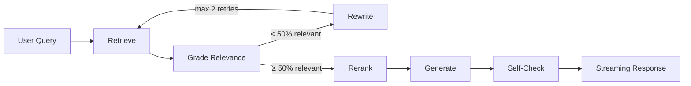

# Retrieval Pipeline

## Overview

The retrieval pipeline uses **LangGraph** to implement a **Corrective RAG** pattern. This enables self-healing query rewriting when results are poor and hallucination detection before returning answers.



---

## LangGraph Nodes

The pipeline is composed of modular nodes in `rag/nodes/`:

| Node | File | Purpose |
|------|------|---------|
| **Retrieve** | `retrieve.py` | Fetch documents via hybrid search |
| **Grade** | `grade.py` | LLM grades each document for relevance (0-1) |
| **Rewrite** | `rewrite.py` | LLM rewrites query if < 50% docs relevant |
| **Rerank** | `rerank.py` | Cross-encoder reranking with OpenAI embeddings |
| **Generate** | `generate.py` | GPT-4o answer generation with citations |
| **Evaluate** | `evaluate.py` | Self-check for hallucinations |

### State Management

All state flows through `RAGState` (TypedDict in `rag/nodes/state.py`):

```python
class RAGState(TypedDict):
    question: str
    documents: List[Document]
    relevance_grades: List[float]
    rewrite_count: int
    generation: Optional[str]
    citations: List[Dict]
    hallucination_detected: bool
    timings: List[Dict]
```

---

## Components

### 1. Hybrid Search
**File**: `app/adapters/vector_postgres.py`

Combines:
- **Vector similarity**: pgvector cosine distance
- **Keyword matching**: PostgreSQL `ts_rank_cd`
- **Weighted score**: `0.8 * vector + 0.2 * keyword`

```python
store.search_hybrid(query_text, embedding, top_k=12, filters={"year_min": 2020})
```

### 2. Reranker
**File**: `app/adapters/rerank_openai.py`

Cross-encoder reranking using `text-embedding-3-large`:
- Embeds query and each candidate
- Computes cosine similarity
- Returns top-k reranked results

### 3. Persona System
**File**: `app/services/prompting.py`

Three personas with different behaviors:

| Persona | Style | Citations |
|---------|-------|-----------|
| `grower` | Casual, practical | Optional |
| `researcher` | Technical, detailed | Required |
| `extension` | Educational | Required |

---

## API Endpoint

**POST `/api/ask`**

Request:
```json
{
  "question": "What are the best cotton irrigation practices?",
  "k": 6,
  "temperature": 0.2,
  "persona": "grower",
  "filters": {"year_min": 2020}
}
```

Response (streaming):
```json
{"type": "answer", "content": "Based on the research..."}
{"type": "sources", "citations": [...]}
{"type": "done", "usage": {...}}
```

---

## Deep Linking

Each citation includes:
- `page`: Page number in PDF
- `bbox`: `[x, y, width, height]` for highlighting
- `filename`: PDF filename for serving

The frontend uses these to:
1. Open PDF at correct page
2. Draw highlight rectangle over source text

---

## Configuration

**`configs/runtime/openai.yaml`**:
```yaml
retrieval:
  k: 6                    # Final results
  mode: dense             # Search mode
  rerank: true            # Enable reranking
  neighbors: 1            # Adjacent chunks
  per_doc: 4              # Max per document
  diversify_per_doc: true # Spread results
```
