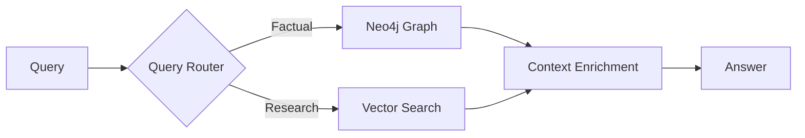

# Product Roadmap

## Current State: MVP ✅

The AI Knowledge Hub is a working RAG-based Q&A system for Australian cotton research.

**Capabilities**:

- ✅ PDF ingestion with Azure Document Intelligence
- ✅ Semantic chunking with bbox mapping
- ✅ Hybrid search (vector + keyword)
- ✅ GPT-4o answer generation
- ✅ Deep linking to PDF source text
- ✅ Persona-based responses (grower/researcher/extension)
- ✅ Next.js chat interface
- ✅ Document library browser

---

## Phase 1: Production Launch (Q1 2026)

**Goal**: Deploy to Azure and ingest 3000 PDFs.

| Task                             | Status  |
| -------------------------------- | ------- |
| Deploy API to Container Apps     | Planned |
| Setup PostgreSQL Flexible Server | Planned |
| Ingest 3000 PDFs (~$450 cost)    | Planned |
| Configure Key Vault secrets      | Planned |
| Setup monitoring (App Insights)  | Planned |
| Lock down CORS/security          | Planned |

---

## Phase 2: User Testing (Q1-Q2 2025)

**Goal**: Collect feedback from pilot users and iterate.

| Feature                   | Description                                  |
| ------------------------- | -------------------------------------------- |
| **Feedback UI**     | Thumbs up/down on answers                    |
| **Analytics**       | Track query patterns, click-through          |
| **Quality Metrics** | Answer accuracy, citation relevance          |
| **Iterate**         | Improve prompts, retrieval based on feedback |

---

## Phase 3: Knowledge Graph Integration (Q2 2026)

**Goal**: Enhance RAG with structured entity relationships.

**Entities to Extract**:

- Cotton varieties
- Pests and diseases
- Chemicals and treatments
- Research trials
- Locations and regions

**Integration Points**:

- Entity-tagged chunks for filtered retrieval
- Graph traversal for multi-hop reasoning
- Decision support queries (e.g., "What varieties resist X?")

---

## Phase 4: Agentic RAG (Q3 2026)

**Goal**: Enable multi-step reasoning and tool use.

| Capability            | Description                                     |
| --------------------- | ----------------------------------------------- |
| **Multi-Query** | Break complex questions into sub-queries        |
| **Tool Use**    | Calculator for yield calculations, date parsing |
| **Memory**      | Conversation context across sessions            |
| **Planning**    | Research plans for complex topics               |

---

## Phase 5: Enterprise Features (Q4 2025+)

| Feature                  | Description                               |
| ------------------------ | ----------------------------------------- |
| **Multi-Tenancy**  | Separate knowledge bases per organization |
| **Access Control** | Role-based document permissions           |
| **Custom Models**  | Fine-tuned embedding/generation models    |
| **API Keys**       | External API access for integrations      |

---

## Technical Debt & Improvements

| Item                                  | Priority |
| ------------------------------------- | -------- |
| Add rate limiting to API              | High     |
| Implement caching layer               | Medium   |
| Add structured logging                | Medium   |
| Create evaluation harness             | Medium   |
| Optimize chunk size based on feedback | Low      |
