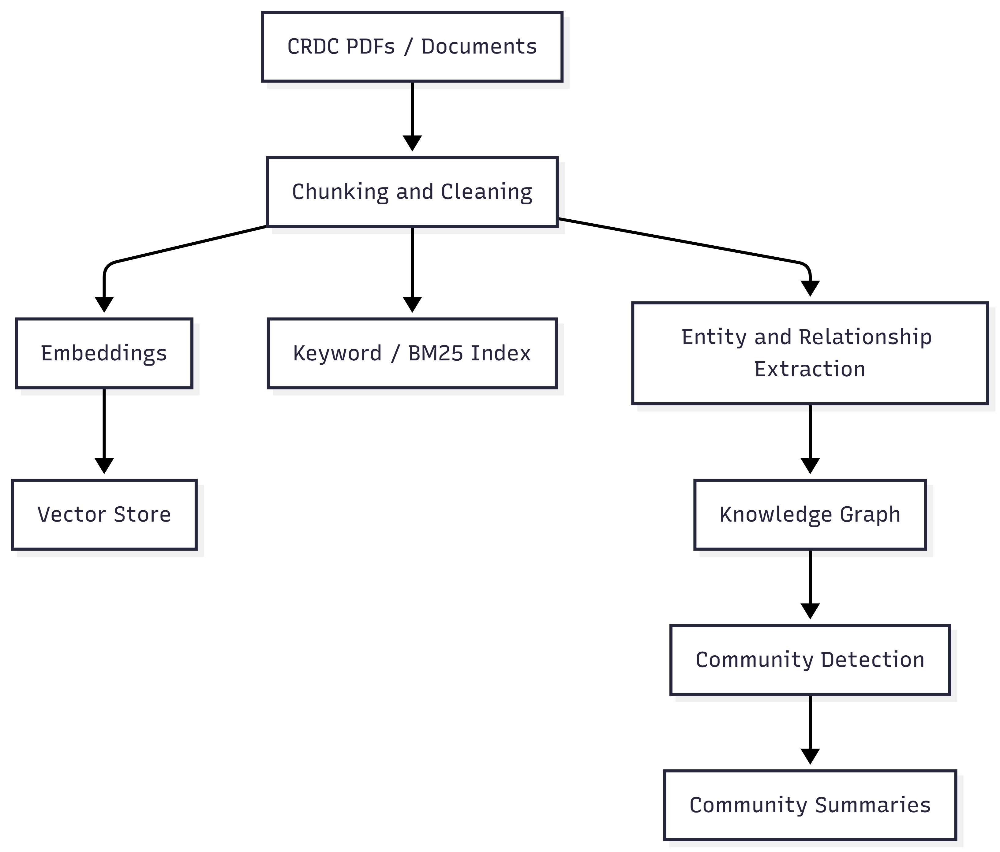

# Workflow Comparison: Current RAG Pipeline vs Agentig/GraphRAG Architecture

## Overview

This document compares the existing RAG workflow used in the current prototype with the proposed upgraded architecture involving agentic orchestration and GraphRAG-based retrieval.

The purpose of this comparison is to illustrate how the system is evolving from a linear hybrid retrieval pipeline into a graph-based system capable of relationships, thematic analysis, and dynamic retrieval.

***
# Current System Workflow

## Architecture Summary

The current architecture is a hybrid RAG pipeline designed to imporve retrieval quality by combining multiple search strategies and ranking mechanisms.

Key things to note are:
- Hybrid retrieval using vector embeddings and keyword search
- Rank fusion to combine multiple retrieval sources
- Cross-encoder reranking for improved semantic relevance
- Relevance grading to determine if retrieved context is sufficient
- Query rewriting when retrieval quality is insufficient

Although this works well in the current situation, the architecture remains largely pipeline-driven, meaning the workflow follows a mostly fixed set of steps.

## Current Workflow
[INSERT HERE IMAGE OF WORKFLOW WHEN FOUND/REMADE]

## Workflow Description

1. A user query is entered
2. The orchestrator sends the query to both the vector store and keyword index
3. Retrieved results are combined using rank fusion
4. A cross-encoder model reranks the results based on semantic relevance
5. A relevance grader determines whether sufficient context has been retrieved
    - 6a. If context is insufficient, system rewrites the query and tries again
    - 6b. If context  is sufficient, generation model produces the response

This design improves retrieval quality, but still treats retrieval as a single structured process, with limited flexibility for different query types

# Proposed System: Agentic GraphRAG Architecture

## Architecture Summary

The proposed system extends this RAG pipeline by adding:
- GraphRAG knoiwledge structures
- Agentic orchestration (maybe)
- multiple retrieval strategies
- Entity and relationship reasoning

The system becomes decision-driven. Instead of always performing the same retrieval sequence, an agentic orchestrator selects the most appropriate retrieval strategy for the query.

Key improvements:
- Knowledge graph construction
- Community detection and summarisation
- Entity-centric retrieval
- Corpus-level thematic search
- Multi-strategy retrieval selection

# Offline GraphRAG Indexing Pipeline

GraphRAG introduces an indexing pipeline that processes documents before any queries occur.

This pipeline constructs the knowledge graph and community summaries used during the query-time reasoning.

## Indexing Pipeline Description
1. Documents are cleaned and split into chunks
2. Each chunk is embedded to create vectors stored in the vector database
3. Chunks are also indexed using keyword search
4. Entities and relationships are extracted to form a knowledge graph
5. The graph is analysed to detect communities of related entities
6. Each community is summarised into high-level topic descriptions

These structures allow the system to reason about relationships and themes acrtoss the document corpus, rather than relying solely on individual text chunks.

# Query-Time Agentic Workflow

When a user query arrives, the system dynamically selects the most appropriate retrieval strategy.

# Retrieval Strategies

## Hybrid RAG Retrieval

Used for specific factual queries where document passages contain the answer.

Examples:
- "Which trials studied bollworm resistance?"
- "What yield improvement was opbserved in cultivar Sicot 746B3F?

This path uses:
- vecto similarity search
- keyword search
- rank fusion
- cross-encoder reranking

## Local GraphRAG Retrieval

Used for queries involving relationships between entities.

Exampoles:
- "How does irrigation strategy affect cotton yield?"
- "Which research programs studied drought tolerance?"

The system:
1. Identifies entities in the query
2. Traverses related nodes in the knowledge graph
3. Collects supporting document evidence

This enables mulkti-hop reasoinignacross documents

## Global GHraphRAG Retrieval

Used for high-level analytical questions

Examples:
- "What major themes appear across CRDC cotton research?"
- "How has drought research evolved over time?"

Instead of retrieving document chunks, the system retrieves community summaries that represent major research topics.

# Summary

The current system implements a high-quality hybrid RAG pipeline designed to improve document retrieval accuracy. However, it remains primarily linear and retrieval-driven

The proposed architecture introduces GraphRAG and agentic orchestration, enabling the system to:
- reason over entity relationships
- answer high-level analytical questions
- dynamically select retrieval strategies
- integrate multiple knowledge sources

This transformation moves the system from a retrieval pipeline towards a knowledge reasing system, improving its ability to create insights across research documents significantly.