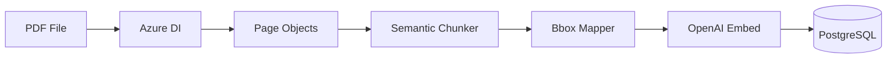

# Ingestion Pipeline

## Overview

The ingestion pipeline processes PDFs into searchable chunks stored in PostgreSQL with vector embeddings.



---

## Components

### 1. Azure Document Intelligence Parser
**File**: `rag/ingest_lib/parser_azure.py`

Extracts from each PDF:
- Markdown-formatted text per page
- Line-level bounding boxes (polygons)
- Page dimensions

```python
parser = AzureParser()
pages = parser.parse("document.pdf")
# Returns: [{"page_number": 1, "text": "...", "bboxes": [...], "width": 8.5, "height": 11}]
```

### 2. Semantic Chunker
**File**: `app/ingest.py` (lines 265-281)

Uses `RecursiveCharacterTextSplitter` with semantic-aware separators:
- 600 tokens per chunk
- 100 token overlap
- Respects paragraph/sentence boundaries

### 3. Bbox Mapper
**File**: `rag/ingest_lib/chunk_bbox_mapper.py`

Maps each chunk to its source bounding boxes for deep linking:
- `find_matching_bboxes()` - Fuzzy text matching
- `calculate_union_bbox()` - Combined highlight area

### 4. PostgreSQL Storage
**File**: `app/adapters/vector_postgres.py`

Schema:
```sql
CREATE TABLE chunks (
    id TEXT PRIMARY KEY,
    doc_id TEXT,
    chunk_index INTEGER,
    page_number INTEGER,
    text TEXT,
    embedding vector(3072),
    metadata JSONB,
    search_vector tsvector
);
```

---

## Running Ingestion

### Command
```bash
make ingest
# or with custom config:
PYTHONPATH=. python app/ingest.py --config configs/ingestion/azure_postgres.yaml
```

### Configuration (`configs/ingestion/azure_postgres.yaml`)
```yaml
parser: azure
storage:
  type: postgres
  table_name: chunks
embedder:
  model: text-embedding-3-large
chunking:
  max_tokens: 600
  overlap: 100
download_dir: "data/raw"
limit: 40  # PDFs to process
```

---

## Cost Estimates

| Component | Cost per PDF | 3000 PDFs |
|-----------|--------------|-----------|
| Azure DI (Layout) | ~$0.15 (15 pages avg) | ~$450 |
| OpenAI Embeddings | ~$0.002 | ~$6 |
| **Total** | | **~$456** |

---

## Re-embedding (No Re-parsing)

To update embeddings without re-parsing (saves Azure DI costs):

```bash
PYTHONPATH=. python scripts/reembed_chunks.py
```

This reads existing chunks from PostgreSQL and generates new embeddings.
