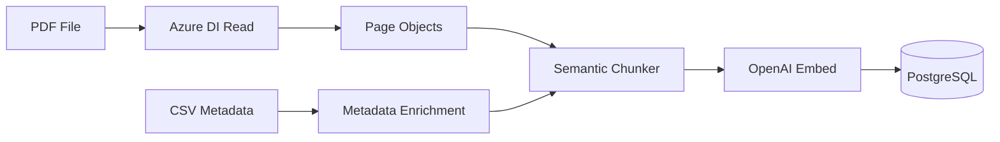

# Ingestion Pipeline

## Overview

The ingestion pipeline processes PDFs into searchable chunks stored in PostgreSQL with vector embeddings.



---

## Components

### 1. Azure Document Intelligence Read Parser
**File**: `rag/ingest_lib/parser_azure_read.py`

Uses the `prebuilt-read` model for cost-effective extraction:
- Markdown-formatted text per page
- Page dimensions
- No bbox (simplified for page-level citations)

**Cost**: $1.50 per 1,000 pages

```python
parser = AzureReadParser()
pages = parser.parse("document.pdf")
# Returns: [{"page_number": 1, "text": "...", "width": 8.5, "height": 11}]
```

### 2. CSV Metadata Enrichment
**File**: `data/metadata/scraped_reports.csv`

Enriches chunks with scraped metadata:
- title, year, author
- abstract, category, subject
- project_code, publisher

### 3. Semantic Chunker
**File**: `app/ingest.py`

Uses `RecursiveCharacterTextSplitter` with semantic-aware separators:
- 600 tokens per chunk
- 100 token overlap
- Respects paragraph/sentence boundaries

### 4. PostgreSQL Storage
**File**: `app/adapters/vector_postgres.py`

Schema:
```sql
CREATE TABLE chunks (
    id TEXT PRIMARY KEY,
    doc_id TEXT,
    chunk_index INTEGER,
    page_number INTEGER,
    text TEXT,
    embedding vector(3072),
    metadata JSONB,
    search_vector tsvector
);

-- Metadata includes:
-- title, year, author, abstract, category, subject, 
-- project_code, filename, page, page_width, page_height
```

---

## Running Ingestion

### Command
```bash
make ingest
# or with custom config:
PYTHONPATH=. python app/ingest.py --config configs/ingestion/azure_read_postgres.yaml
```

### Configuration (`configs/ingestion/azure_read_postgres.yaml`)
```yaml
parser: azure_read  # Uses Azure DI Read model

metadata:
  csv_path: "data/metadata/scraped_reports.csv"
  match_by: "filename"

storage:
  type: postgres
  table_name: chunks

embedder:
  provider: openai
  model: text-embedding-3-large

chunking:
  max_tokens: 600
  overlap: 100

download_dir: "data/raw"
limit: 100  # PDFs to process
```

---

## Cost Estimates

| Component | Cost per PDF | 63 PDFs (~945 pages) | 3000 PDFs (~45k pages) |
|-----------|--------------|----------------------|------------------------|
| Azure DI Read | ~$0.02 (15 pages) | ~$1.42 | ~$68 |
| OpenAI Embeddings | ~$0.002 | ~$0.13 | ~$6 |
| **Total** | | **~$1.55** | **~$74** |

---

## Re-embedding (No Re-parsing)

To update embeddings without re-parsing (saves Azure DI costs):

```bash
PYTHONPATH=. python scripts/reembed_chunks.py
```

This reads existing chunks from PostgreSQL and generates new embeddings.

---

## Citations

With page-level tracking, citations link directly to PDF page:
```
"Document Title" (page X)
```

Deep linking URL format: `/pdf/{filename}#page={page_number}`
